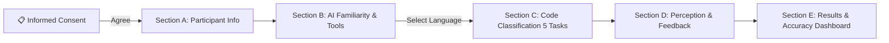

# Students' Ability to Distinguish AI-Generated Code from Human-Written Code 🎓🤖

An interactive research survey application and benchmark study evaluating computer science students' capacity to distinguish source code generated by Artificial Intelligence (AI) from code written by human developers.

[](https://github.com/DarshanHeble/survey_Feedback)
[](#)
[](#)

---

## 📌 Project Overview

With the rapid emergence of AI coding assistants (ChatGPT, Copilot, Gemini, Claude, Cursor), distinguishing AI-generated source code from human-written code is becoming increasingly challenging. This web application serves as an empirical research tool for conducting a survey-based benchmark study across **5 key programming languages**:

- 🐍 **Python** (Programming & Algorithms)
- ☕ **Java** (Data Structures & OOP)
- ⚡ **C++** (Algorithms & Memory Management)
- 🌐 **JavaScript** (Web Application Logic)
- 🗄️ **SQL** (Database Queries)

Participants complete an informed consent process, provide demographic & AI familiarity context, select their primary programming language, and evaluate **5 side-by-side code snippets** to determine which snippet was written by a human developer.

---

## ✨ Features & Highlights

- **🔒 Strict Informed Consent Enforcement:** Participants must read and explicitly agree to research terms before accessing survey sections.
- **🎯 Single Language Dynamic Filtering:** Participants pick 1 primary programming language and evaluate 5 targeted code snippet pairs.
- **⚡ Dual Code Snippet Side-by-Side Viewer:** Styled syntax highlighting powered by Prism.js with copy-to-clipboard functionality.
- **📊 Instant Ground-Truth Scoring Engine:** Calculates accuracy percentages against research benchmark answer keys and provides a detailed breakdown table.
- **📥 Submission Data Export:** Allows participants/researchers to download response data as JSON (`survey_submission_data.json`).
- **🌗 Theme Toggle & Persistence:** Dark and light mode toggle with state saved in `localStorage`.

---

## 📋 Survey Flow & Workflow



1. **Step 0: Informed Consent Page:** Mandatory academic consent detailing survey-only data usage and 100% anonymity.
2. **Step A: Participant Information:** Demographics, age group, degree program (BCA, MCA, B.Sc, M.Sc, B.Tech), year of study, and coding experience.
3. **Step B: AI Tool Familiarity:** Exposure to AI assistants (ChatGPT, Copilot, Gemini, Claude, Cursor), frequency of usage, and confidence rating.
4. **Step C: Code Classification (5 Questions):** Dual code snippet viewer comparing Snippet A vs Snippet B with 1–5 confidence ratings.
5. **Step D: Overall Perception & Feedback:** Rating language classification difficulty and key code characteristics (naming, style, modularity).
6. **Step E: Benchmark Results:** Real-time accuracy percentage score, performance badge, and detailed question-by-question breakdown.

---

## 🛠️ Project Structure

```
survery_Feedback/
├── index.html                   # Main single-page web app template & section views
├── index.css                    # Design system (Dark/Light themes, stepper, CSS variables)
├── app.js                       # Logic controller, consent guard, step router & scoring engine
├── snippets_data.js             # 25 benchmark code snippet dataset (Python, Java, C++, JS, SQL)
├── questionnaire.md             # Markdown questionnaire documentation
├── pdf_extracted.txt            # Parsed research benchmark raw dataset
├── Research_Benchmark_*.pdf    # Original research benchmark PDF document
└── README.md                    # Project documentation
```

---

## 🚀 Getting Started

### Running Locally

No complex dependencies required! You can run the application locally using any basic HTTP web server.

1. **Clone the repository:**
   ```bash
   git clone https://github.com/DarshanHeble/survey_Feedback.git
   cd survey_Feedback
   ```

2. **Start a local dev server:**
   Using Node.js (`npx`):
   ```bash
   npx serve -p 3000 ./
   ```
   Or using Python:
   ```bash
   python3 -m http.server 3000
   ```

3. **Open in browser:**
   Navigate to `http://localhost:3000` in your web browser.

---

## 📄 License & Academic Attribution

This project is created for **academic research purposes only**. All participant responses remain anonymous and non-commercial.
